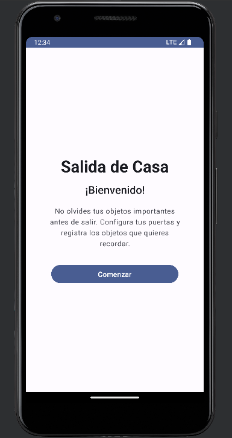
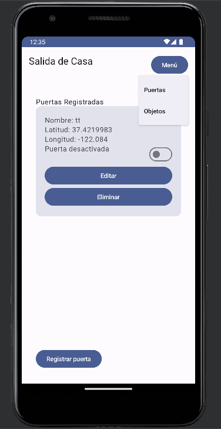
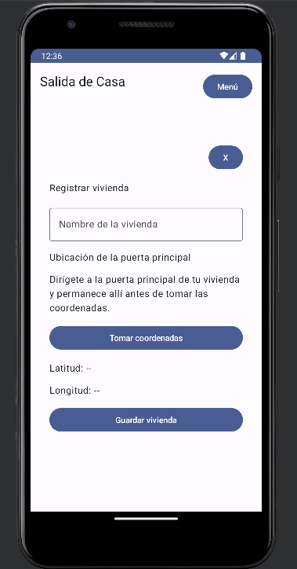
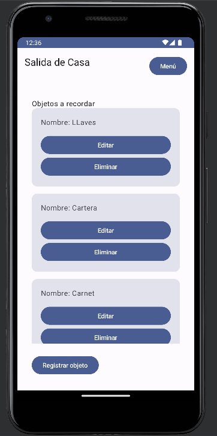
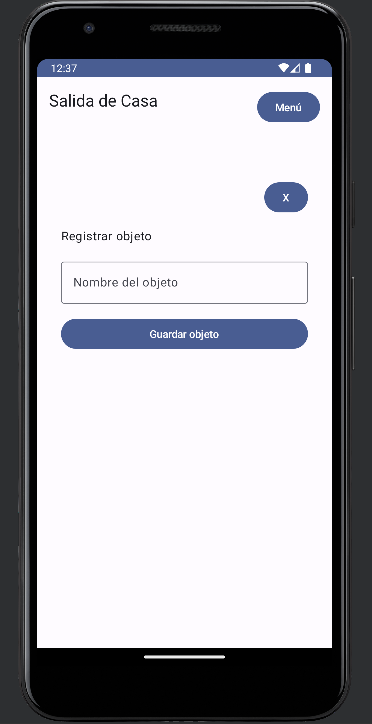

# 🏠 Salida de Casa

Aplicación móvil Android desarrollada en **Kotlin** cuyo objetivo es ayudar al usuario a recordar objetos importantes antes de salir de casa.

La aplicación permite registrar diferentes **puertas o puntos de salida**, asociarles una ubicación geográfica y activar o desactivar individualmente cada una. Cuando el dispositivo detecta que el usuario entra en la zona configurada de una puerta activa, la aplicación genera una **notificación con los objetos que el usuario desea recordar**.

> **Nota:** El funcionamiento del geofencing depende de los servicios de ubicación y de las restricciones de segundo plano implementadas por cada fabricante de dispositivos Android.

---

## 📱 Funcionalidades

### 👋 Pantalla de bienvenida

La aplicación cuenta con una pantalla inicial desde la cual el usuario puede acceder al menú principal.

### 🚪 Gestión de puertas

El usuario puede:

* Registrar múltiples puertas.
* Asignar un nombre a cada puerta.
* Obtener automáticamente la latitud y longitud mediante el GPS.
* Editar una puerta.
* Modificar el nombre y las coordenadas.
* Eliminar una puerta.
* Activar o desactivar una puerta mediante un `Switch`.
* Registrar un geofence para cada puerta activa.
* Eliminar el geofence cuando una puerta es desactivada o eliminada.
* Actualizar el geofence cuando se modifican las coordenadas de una puerta.

## Pantallas de la aplicación

### Pantalla de Bienvenida


### Pantalla Menú - Puertas


### Pantalla Registro/Edición de puertas


### Pantalla Menú - Objetos


### Pantalla Registro/Edición de Objetos


La posibilidad de registrar varias puertas permite utilizar la aplicación en diferentes puntos de salida.

Por ejemplo:

```text
Casa
 ├── Puerta principal
 ├── Puerta trasera
 └── Garaje
```

Cada una puede tener su propia ubicación y estado.

---

### 📋 Gestión de objetos

El usuario puede crear una lista general de objetos que desea recordar.

Ejemplo:

```text
• Llaves
• Cartera
• Documento de identidad
• Audífonos
```

Los objetos son independientes de las puertas. Esto significa que la misma lista se utiliza sin importar por cuál puerta salga el usuario.

---

### 📍 Obtención de ubicación

Cuando el usuario registra o edita una puerta puede solicitar su ubicación actual.

La aplicación obtiene:

```text
Latitud
Longitud
```

El usuario debe encontrarse físicamente en la ubicación que desea utilizar como punto de referencia, por ejemplo, frente a la puerta principal.

---

### 📡 Geofencing

Cada puerta activa tiene asociada una geovalla.

Conceptualmente:

```text
             Zona de geofencing
          ┌─────────────────────┐
          │                     │
          │         📍          │
          │       Puerta        │
          │                     │
          └─────────────────────┘
```

Cuando el dispositivo detecta que el usuario entra en esta zona, Android genera un evento que es procesado por la aplicación.

---

### 🔔 Recordatorios

Cuando se detecta la entrada a una zona activa:

```text
Geofence
    ↓
GeofenceBroadcastReceiver
    ↓
Consulta de objetos
    ↓
NotificationHelper
    ↓
Notificación
```

La notificación recuerda al usuario los objetos registrados.

Ejemplo:

```text
Antes de salir

Recuerda llevar:

• Llaves
• Cartera
• Documento
```

---

# 🏗️ Arquitectura

La aplicación utiliza principalmente una arquitectura **MVVM (Model–View–ViewModel)** junto con componentes de Android Jetpack.

```text
┌─────────────────────────────────────────────┐
│                    UI                       │
│                                             │
│ WelcomeScreen                               │
│ MenuScreen                                  │
│ PuertaScreen                                │
│ ObjetoScreen                                │
└──────────────────────┬──────────────────────┘
                       │
                       ▼
┌─────────────────────────────────────────────┐
│                  VIEWMODEL                   │
│                                             │
│ PuertaViewModel                             │
│ ObjetoViewModel                             │
│                                             │
│ • Gestiona estados                          │
│ • Ejecuta operaciones                       │
│ • Coordina UI y datos                       │
└──────────────────────┬──────────────────────┘
                       │
              ┌────────┴─────────┐
              ▼                  ▼
┌──────────────────────┐ ┌────────────────────┐
│        ROOM          │ │ SERVICIOS ANDROID  │
│                      │ │                    │
│ PuertaDao            │ │ GeofenceManager    │
│ ObjetoDao            │ │ Fused Location     │
│ AppDatabase          │ │ NotificationHelper │
└──────────┬───────────┘ └──────────┬─────────┘
           │                        │
           ▼                        ▼
┌──────────────────────┐ ┌────────────────────┐
│ SQLite               │ │ Google Play        │
│                      │ │ Services           │
│ puertas              │ │                    │
│ objetos              │ │ Geofencing         │
└──────────────────────┘ └────────────────────┘
```

## Flujo general

```text
Usuario
   │
   ▼
Interfaz Compose
   │
   ▼
ViewModel
   │
   ├──────────────► Room / SQLite
   │
   └──────────────► Servicios de ubicación
                         │
                         ▼
                     Geofencing
                         │
                         ▼
                BroadcastReceiver
                         │
                         ▼
                  Lista de objetos
                         │
                         ▼
                    Notificación
```

---

# 🧩 Modelo de datos

La aplicación utiliza dos entidades principales.

## Puerta

Representa un punto de salida registrado por el usuario.

```text
Puerta
├── id
├── nombre
├── latitud
├── longitud
└── activa
```

Cada puerta puede tener un geofence independiente.

---

## Objeto

Representa un elemento que el usuario desea recordar.

```text
Objeto
├── id
└── nombre
```

Los objetos son globales y no están asociados a una puerta específica.

---

# 🗄️ Persistencia

La persistencia local se implementa mediante **Room**.

La estructura utilizada es:

```text
Entity
   ↓
DAO
   ↓
RoomDatabase
   ↓
SQLite
```

### Entidades

```text
Puerta.kt
Objeto.kt
```

### DAO

```text
PuertaDao.kt
ObjetoDao.kt
```

### Base de datos

```text
AppDatabase.kt
```

La información permanece almacenada localmente en el dispositivo.

---

# 📍 Sistema de localización

La aplicación utiliza **Google Play Services Location**.

## FusedLocationProviderClient

Se utiliza para obtener la ubicación actual del dispositivo.

```text
Dispositivo
    ↓
GPS / proveedores de ubicación
    ↓
FusedLocationProviderClient
    ↓
Latitud + Longitud
```

---

## GeofencingClient

Se utiliza para registrar y administrar las zonas geográficas.

Cada puerta activa puede generar un geofence:

```text
Puerta
  ↓
Latitud
Longitud
Radio
  ↓
Geofence
```

El sistema monitorea la ubicación y genera eventos cuando el usuario entra en una zona registrada.

---

# 📡 Flujo del Geofence

Cuando una puerta se activa:

```text
Puerta activa
     ↓
GeofenceManager
     ↓
GeofencingClient
     ↓
Google Play Services
     ↓
Zona registrada
```

Cuando el usuario entra:

```text
Usuario entra en la zona
          ↓
Google Play Services
          ↓
GeofenceBroadcastReceiver
          ↓
Evento ENTER
          ↓
ObjetoDao
          ↓
Objetos registrados
          ↓
NotificationHelper
          ↓
Notificación
```

---

# 🔔 Sistema de notificaciones

La aplicación utiliza un `NotificationHelper` encargado de administrar las notificaciones.

Entre sus responsabilidades se encuentran:

* Crear el canal de notificaciones.
* Comprobar el estado de las notificaciones.
* Solicitar el permiso en Android 13 o superior.
* Construir las notificaciones.
* Mostrar los objetos que el usuario debe recordar.

En Android 13+ se utiliza:

```text
POST_NOTIFICATIONS
```

---

# 🛠️ Tecnologías utilizadas

| Tecnología                        | Utilización                                 |
| --------------------------------- | ------------------------------------------- |
| **Kotlin**                        | Lenguaje principal                          |
| **Jetpack Compose**               | Construcción de la interfaz                 |
| **Material 3**                    | Componentes visuales                        |
| **Navigation Compose**            | Navegación entre pantallas                  |
| **MVVM**                          | Arquitectura de la aplicación               |
| **ViewModel**                     | Gestión del estado y lógica de presentación |
| **Room**                          | Persistencia de datos                       |
| **SQLite**                        | Base de datos local                         |
| **Kotlin Coroutines**             | Operaciones asíncronas                      |
| **Google Play Services Location** | Localización y geofencing                   |
| **Geofencing API**                | Detección de entrada a zonas                |
| **BroadcastReceiver**             | Recepción de eventos del geofence           |
| **NotificationCompat**            | Generación de notificaciones                |
| **Gradle**                        | Gestión de dependencias y compilación       |

---

# 📂 Estructura del proyecto

La organización principal del proyecto es:

```text
com.example.prueba2
│
├── data
│   ├── AppDatabase.kt
│   ├── Puerta.kt
│   ├── PuertaDao.kt
│   ├── Objeto.kt
│   └── ObjetoDao.kt
│
├── location
│   ├── GeofenceManager.kt
│   └── GeofenceBroadcastReceiver.kt
│
├── notification
│   └── NotificationHelper.kt
│
├── ui
│   ├── screens
│   │   │
│   │   ├── welcome
│   │   │   └── WelcomeScreen.kt
│   │   │
│   │   ├── menu
│   │   │   └── MenuScreen.kt
│   │   │
│   │   └── vivienda
│   │       ├── PuertaScreen.kt
│   │       ├── PuertaViewModel.kt
│   │       ├── ObjetoScreen.kt
│   │       └── ObjetoViewModel.kt
│   │
│   └── theme
│
└── MainActivity.kt
```

---

# 🔐 Permisos

La aplicación utiliza permisos relacionados con ubicación y notificaciones.

```xml
<uses-permission android:name="android.permission.ACCESS_FINE_LOCATION" />
<uses-permission android:name="android.permission.ACCESS_COARSE_LOCATION" />
<uses-permission android:name="android.permission.ACCESS_BACKGROUND_LOCATION" />
<uses-permission android:name="android.permission.POST_NOTIFICATIONS" />
```

### Ubicación

La aplicación requiere acceso a la ubicación para:

* Obtener las coordenadas de una puerta.
* Registrar geofences.
* Detectar la entrada del usuario en las zonas configuradas.

Para que el geofencing pueda funcionar de forma adecuada cuando la aplicación no está visible, es necesario permitir el acceso a la ubicación en segundo plano según las opciones disponibles en la versión de Android y el fabricante del dispositivo.

### Notificaciones

En Android 13 o superior se solicita:

```text
POST_NOTIFICATIONS
```

El usuario debe permitir las notificaciones para recibir los recordatorios.

---

# 🔄 Casos principales

## Registrar una puerta

```text
Registrar puerta
      ↓
Introducir nombre
      ↓
Obtener coordenadas
      ↓
Guardar puerta
      ↓
¿Está activa?
      ↓
Sí
      ↓
Registrar Geofence
```

---

## Desactivar una puerta

```text
Switch → OFF
      ↓
Eliminar Geofence
      ↓
Puerta permanece almacenada
      ↓
No genera recordatorios
```

La puerta no se elimina de la aplicación. Simplemente deja de utilizarse para generar eventos de geofencing.

---

## Activar una puerta

```text
Switch → ON
      ↓
Registrar Geofence
      ↓
Google Play Services
      ↓
Monitorear ubicación
```

---

## Editar una puerta

```text
Editar
  ↓
Modificar nombre/coordenadas
  ↓
Eliminar Geofence anterior
  ↓
Actualizar puerta
  ↓
Registrar nuevo Geofence
```

Esto evita que permanezca activa la ubicación anterior.

---

## Eliminar una puerta

```text
Eliminar puerta
      ↓
Eliminar Geofence
      ↓
Eliminar registro de Room
```

---

# 🧠 Decisiones de diseño

### ¿Por qué Room?

Porque la aplicación necesita almacenar información localmente y no requiere actualmente un servidor para las funciones principales.

Esto permite que las puertas y objetos estén disponibles incluso sin conexión a Internet.

### ¿Por qué MVVM?

Permite separar:

```text
Interfaz
   ≠
Lógica
   ≠
Persistencia
```

Esto facilita el mantenimiento y la ampliación futura de la aplicación.

### ¿Por qué Jetpack Compose?

Compose permite construir la interfaz directamente utilizando Kotlin y manejar los estados de la UI de forma declarativa.

### ¿Por qué Geofencing?

En lugar de consultar continuamente la ubicación desde la aplicación, se registra una zona geográfica y el sistema se encarga de detectar los eventos correspondientes.

Esto resulta especialmente útil para una aplicación cuyo objetivo es detectar cuándo el usuario llega a una zona determinada.

---

# 🚀 Flujo completo de la aplicación

El funcionamiento completo puede resumirse de la siguiente manera:

```text
                 ┌──────────────┐
                 │    Usuario   │
                 └──────┬───────┘
                        │
                        ▼
                 ┌──────────────┐
                 │  Welcome     │
                 └──────┬───────┘
                        │
                        ▼
                 ┌──────────────┐
                 │    Menú      │
                 └──────┬───────┘
                        │
              ┌─────────┴─────────┐
              │                   │
              ▼                   ▼
       ┌─────────────┐     ┌─────────────┐
       │   Puertas   │     │   Objetos   │
       └──────┬──────┘     └──────┬──────┘
              │                   │
              ▼                   ▼
           Room DB             Room DB
              │
              ▼
       Puerta activa
              │
              ▼
      GeofenceManager
              │
              ▼
      Google Play Services
              │
              ▼
       Usuario entra
       en la zona
              │
              ▼
   GeofenceBroadcastReceiver
              │
              ▼
         ObjetoDao
              │
              ▼
      Objetos registrados
              │
              ▼
      NotificationHelper
              │
              ▼
          🔔 Recordatorio
```

---

# 🎯 Objetivo del proyecto

El objetivo de **Salida de Casa** es proporcionar un mecanismo automático de recordatorio basado en la ubicación.

En lugar de depender de que el usuario recuerde revisar manualmente una lista antes de salir, la aplicación utiliza el contexto de ubicación para generar el recordatorio cuando el usuario se encuentra en las proximidades de una puerta configurada.

---

# ⚠️ Consideraciones

El funcionamiento de geofencing puede variar entre dispositivos Android debido a:

* Versión de Android.
* Fabricante del dispositivo.
* Gestión de batería.
* Restricciones de aplicaciones en segundo plano.
* Configuración de ubicación.
* Permisos concedidos por el usuario.
* Configuración de Google Play Services.

Por este motivo, una implementación de geofencing puede comportarse de manera diferente entre dispositivos aun utilizando el mismo código.

---

# 📌 Estado del proyecto

### Funcionalidades implementadas

* [x] Pantalla de bienvenida
* [x] Menú principal
* [x] Arquitectura MVVM
* [x] Base de datos Room
* [x] Registro de puertas
* [x] Edición de puertas
* [x] Eliminación de puertas
* [x] Activación/desactivación de puertas
* [x] Obtención de latitud y longitud
* [x] Registro de geofences
* [x] Eliminación de geofences
* [x] Actualización de geofences
* [x] Registro de objetos
* [x] Edición/eliminación de objetos
* [x] GeofenceBroadcastReceiver
* [x] Sistema de notificaciones
* [x] Permisos de ubicación
* [x] Permiso de notificaciones para Android 13+
* [x] Detección de entrada a una zona
* [x] Consulta automática de objetos
* [x] Recordatorio mediante notificación

---

# 👨‍💻 Proyecto

**Nombre:** Salida de Casa

**Plataforma:** Android

**Lenguaje:** Kotlin

**Interfaz:** Jetpack Compose

**Arquitectura:** MVVM

**Persistencia:** Room / SQLite

**Localización:** Google Play Services Location

**Geofencing:** Android Geofencing API

**Notificaciones:** Android Notification API
